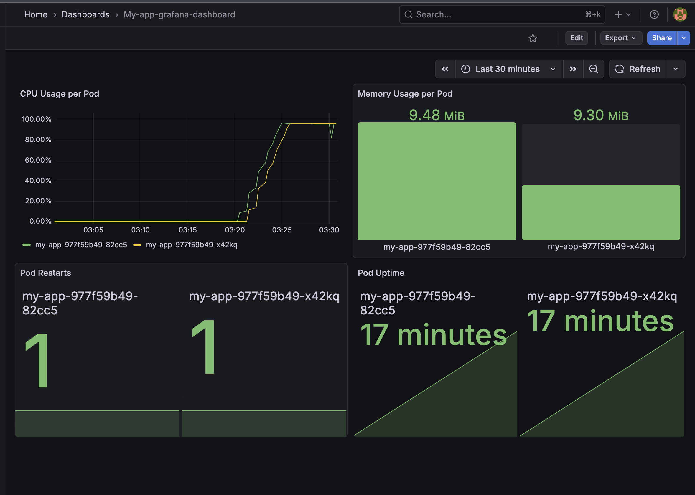

# Monitoring with Prometheus and Grafana

Prometheus and Grafana are installed on the minikube cluster with Helm. Prometheus collects cluster and pod metrics, and Grafana visualizes them. The dashboard here monitor the application pods deployed by the Terraform code in this repository (namespace `terraform-demo`).



## Dashboard

### my-app Pod Metrics
A dashboard for the application pods in the `terraform-demo` namespace, with four panels:

| Panel | What it shows |
|---|---|
| **CPU Usage per Pod** | 5-minute CPU usage rate per pod |
| **Memory Usage per Pod** | Working-set memory per pod |
| **Pod Restarts** | Container restart count per pod |
| **Pod Uptime** | Time since each pod started |

The CPU spike in the screenshot was generated on purpose by running a busy loop inside the pods, to demonstrate the panel. It is not real application traffic.

Dashboard file: [`dashboard/my-app-pod-metrics.json`](dashboard/my-app-pod-metrics.json)

To import the dashboard into another Grafana, go to **Dashboards → New → Import**, upload the JSON file and select your Prometheus data source.

## Install

```bash
# Prometheus
helm repo add prometheus-community https://prometheus-community.github.io/helm-charts
helm repo update
helm install prometheus prometheus-community/prometheus

# Grafana
helm repo add grafana https://grafana.github.io/helm-charts
helm repo update
helm install grafana grafana/grafana
```

Check that everything is running:
```bash
kubectl get pods
kubectl get svc
```

## Access the UIs

The services are `ClusterIP` by default, so expose them as NodePort services:

```bash
kubectl expose service prometheus-server --type=NodePort --target-port=9090 --name=prometheus-server-np
kubectl expose service grafana --type=NodePort --target-port=3000 --name=grafana-np
```

With the Docker driver on macOS, the minikube node IP is not reachable from the host, so use a tunnel. Keep the terminal open while you use it:

```bash
minikube service prometheus-server-np
minikube service grafana-np
```

Get the Grafana admin password (username: `admin`):
```bash
kubectl get secret --namespace default grafana -o jsonpath="{.data.admin-password}" | base64 --decode ; echo
```

## Connect Grafana to Prometheus
In Grafana, go to **Connections → Data sources → Add data source → Prometheus** and set the URL to:

```
http://prometheus-server.default.svc.cluster.local
```

## Queries used in the my-app dashboard

```promql
# CPU Usage per Pod
sum(rate(container_cpu_usage_seconds_total{namespace="terraform-demo", pod=~"my-app.*"}[5m])) by (pod)

# Memory Usage per Pod
sum(container_memory_working_set_bytes{namespace="terraform-demo", pod=~"my-app.*"}) by (pod)

# Pod Restarts
kube_pod_container_status_restarts_total{namespace="terraform-demo", pod=~"my-app.*"}

# Pod Uptime
time() - kube_pod_start_time{namespace="terraform-demo", pod=~"my-app.*"}
```

